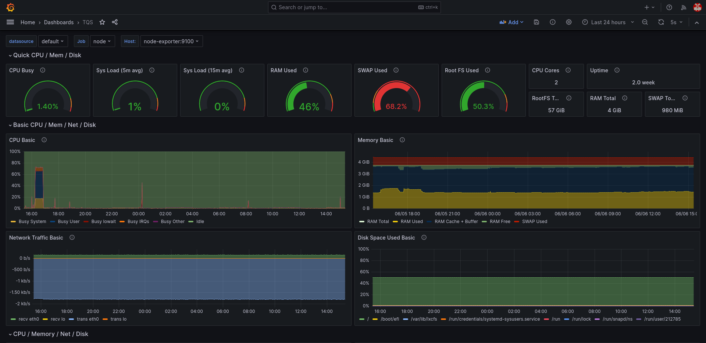
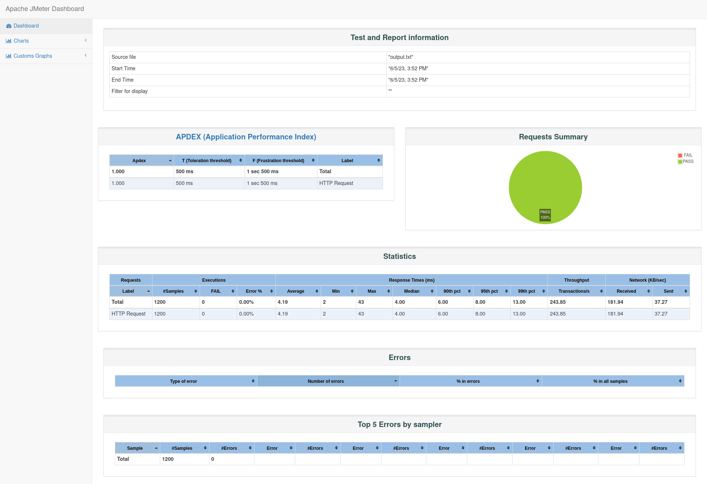

# Roadrunner

# Team

| Nmec   | Name              | Role          |
|--------|-------------------|---------------|
| 102442 | Daniel Ferreira   | Team Leader   |
| 103823 | Mariana Andrade   | Product Owner |
| 97787  | Vicente Barros    | DevOps        |
| 103600 | Guilherme Antunes | QA Engineer   | 

# Diagrams

# Components

## PickUp Service
### [Roadrunner Frontend](https://github.com/Roadrunner-TQS/roadrunner-frontend)

### [Roadrunner Backend](https://github.com/Roadrunner-TQS/roadrunner-backend)

## e-Shop
### [Roadrunner Frontend](https://github.com/Roadrunner-TQS/shop-frontend)

### [Roadrunner Backend](https://github.com/Roadrunner-TQS/shop-backend)

# Links
### [Github](https://github.com/roadrunner-tqs/)

### [Jira](https://road-runner.atlassian.net/jira/software/projects/RR/boards/1)

### [Drive](https://drive.google.com/drive/folders/1_NjxShYoKq77boAzPrktCV711Wl87aK0?usp=sharing)

# Deployment

## [Roadrunner Frontend (192.168.160.227:8085)](http://192.168.160.227:8085/)
## [Roadrunner Backend (192.168.160.227:8080)](http://192.168.160.227:8085/)
## [e-Shop Frontend (192.168.160.227:8095)](http://192.168.160.227:8095/)
## [e-Shop Backend (192.168.160.227:8090)](http://192.168.160.227:8090/)

# SonarCloud

## [Roadrunner Frontend](https://sonarcloud.io/project/overview?id=Roadrunner-TQS_shop-frontend)
## [Roadrunner Backend](https://sonarcloud.io/project/overview?id=Roadrunner-TQS_shop-backend)

## [e-Shop Frontend](https://sonarcloud.io/project/overview?id=Roadrunner-TQS_roadrunner-frontend)

## [e-Shop Backend](https://sonarcloud.io/project/overview?id=Roadrunner-TQS_roadrunner-backend)

# Grafana Dashboard

This is not visible to the public, but you can see a screenshot of it 

# Performance testing

To ensure that our application is able to handle a large number of requests, we used [JMeter](https://jmeter.apache.org/) to perform load testing.

