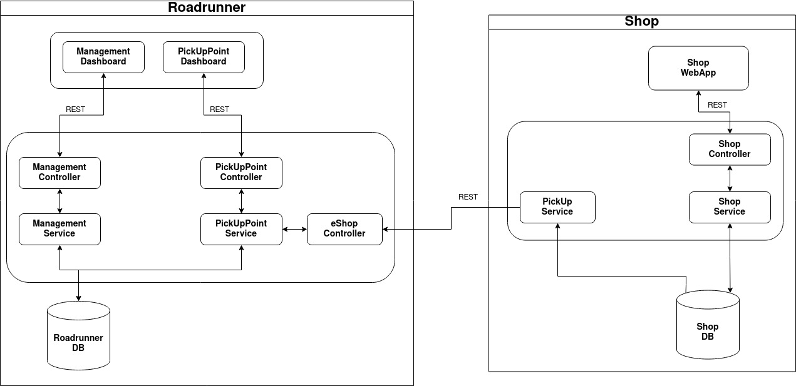

# Roadrunner

# Team

| Nmec   | Name              | Role          |
|--------|-------------------|---------------|
| 102442 | Daniel Ferreira   | Team Leader   |
| 103823 | Mariana Andrade   | Product Owner |
| 97787  | Vicente Barros    | DevOps        |
| 103600 | Guilherme Antunes | QA Engineer   | 

# Diagrams

# Components

## PickUp Service
### [Roadrunner Frontend](https://github.com/Roadrunner-TQS/roadrunner-frontend)

### [Roadrunner Backend](https://github.com/Roadrunner-TQS/roadrunner-backend)

## e-Shop
### [Roadrunner Frontend](https://github.com/Roadrunner-TQS/shop-frontend)

### [Roadrunner Backend](https://github.com/Roadrunner-TQS/shop-backend)

# Links
### [Github](https://github.com/roadrunner-tqs/)

### [Jira](https://road-runner.atlassian.net/jira/software/projects/RR/boards/1)

### [Drive](https://drive.google.com/drive/folders/1_NjxShYoKq77boAzPrktCV711Wl87aK0?usp=sharing)
